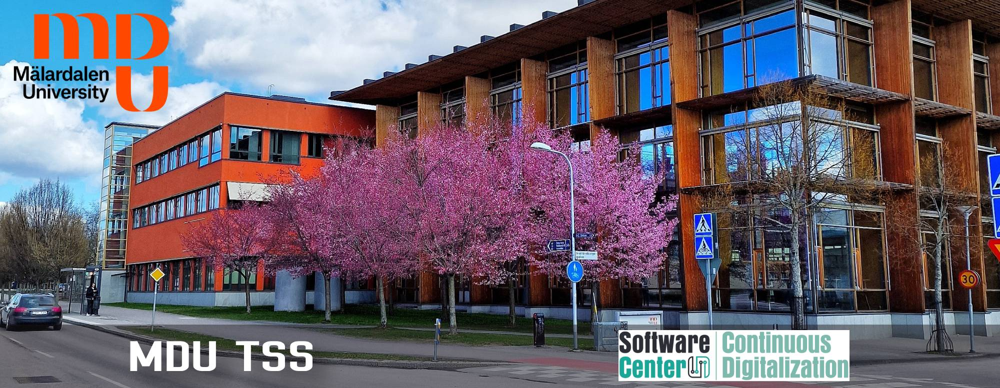

<table>
  <tr style="padding-top: 0px;">
    <td colspan="2" style="padding: 0;">
      
    </td>
  </tr>
  <tr style="padding-top: 0px;">
    <td style="padding-top: 0px; text-align: center;"><a href="https://sites.mdu.se/tss/">https://sites.mdu.se/tss</a></td>
    <td style="padding-top: 0px; text-align: center;"><a href="https://www.software-center.se/">https://www.software-center.se</a></td>
  </tr>
</table>

 

 

##### **About**
**TrustCPS-AI** is a workshop on *Trustworthy AI-enabled Cyber-Physical Systems*, addressing the challenges of integrating AI into CPS in a dependable, explainable, and certifiable manner. It provides a platform for discussing formal methods, runtime assurance, regulation-aware design, and the engineering of trustworthy AI components in domains like automotive, avionics, and industrial automation.

The workshop features invited talks by Edward A. Lee (UC Berkeley) on the trade-off between certainty and intelligence; Pierluigi Nuzzo (UC Berkeley) on assume-guarantee contracts for autonomy; Hazem Torfah (Chalmers) on learning and monitoring operational design domains; Shiva Sander Tavallaey (ABB/KTH) on balancing innovation and reliability in industrial AI systems; Claire Pagetti (ONERA) on certifiable ML in airborne systems; Matthias Wagner (Lund) on the impact of the EU AI Act; and Marjan Sirjani (MDU) on runtime guardrails for AI-based CPS.

   

##### **Date and Place**
**Wednesday May 21, 2025**

**Omega, Mälardalen University, Västerås, Sweden**  

*Zoom link for online participants: [https://mdu-se.zoom.us/j/69385371593](https://mdu-se.zoom.us/j/69385371593)*

---

 

##### **Registration**
**We kindly ask you to register via the following link (registration is free):**  
**[link to registration](https://forms.gle/9sS46HLt1d7FA4fg9)**

   

##### **Invited Speakers**
--- 

**[Edward A. Lee](https://www2.eecs.berkeley.edu/Faculty/Homepages/lee.html), UC Berkeley, USA**

**[Hazem Torfah](https://www.chalmers.se/en/persons/hazemto/), Chalmers University of Technology, Sweden**

**[Marjan Sirjani](https://www.es.mdu.se/staff/3242-Marjan_Sirjani), Mälardalen University, Sweden** 

**[Matthias Wagner](https://portal.research.lu.se/sv/persons/matthias-wagner), Lund University, Sweden**

**[Shiva Sander Tavallaey](https://www.kth.se/profile/tssander), ABB and KTH, Sweden**

**[Claire Pagetti](https://www.onera.fr/en/staff/claire-pagetti), ONERA, France**

**[Pierluigi Nuzzo](https://www2.eecs.berkeley.edu/Faculty/Homepages/pnuzzo.html), UC Berkeley, USA**

 

##### **Schedule**
--- 
**09:00 - 10:00** &nbsp; &nbsp; **Edward Lee:** Certainty or Intelligence: Pick One!

**10:00 - 10:15** &nbsp; &nbsp; **Break**  

**10:15 - 11:00** &nbsp; &nbsp; **Hazem Torfah:** Learning and Monitoring the Operational Design Domain for AI-Based Autonomy

**11:00 - 12:00** &nbsp; &nbsp; **Marjan Sirjani and the team:** Guardians of the AI-enabled Cyber-Physical Systems  

**12:00 - 13:00** &nbsp; &nbsp; **Lunch Break***  

**13:00 - 13:40** &nbsp; &nbsp; **Matthias Wagner:** The EU AI Act in Light of CPS: Assessing the Challenges and Impact of the Act’s Requirements on Industry

**13:40 - 14:10** &nbsp; &nbsp; **Shiva Sander Tavallaey:** Trustworthy AI in Industrial Contexts: Balancing Innovation and Reliability

**14:10 - 15:00** &nbsp; &nbsp; **Panel**  

**15:00 - 15:15** &nbsp; &nbsp; **Break**  

**15:15 - 16:00** &nbsp; &nbsp; **Claire Pagetti (Online):** Certification of Machine Learning Based System - contribution of Formal Verification  

**16:00 - 17:00** &nbsp; &nbsp; **Pierluigi Nuzzo (Online):** Assume-Guarantee Contracts for Trustworthy Autonomous Cyber-Physical Systems  

 

* Lunch will not be provided by the workshop, we will have lunch at the Rosenhill restaurant at MDU. Welcome to join and pay yourself. 🙂

##### **Invited Talks**
---

 

##### **Edward A. Lee**  
---
##### **Title: Certainty or Intelligence: Pick One!**

##### **Abstract**  
Cyber-physical systems are systems that integrate software and networking with physical components that sense and actuate in the physical world. Traditionally, to make them trustworthy, engineers strive to make their behaviors predictable, repeatable, and provably safe. While security is essential to achieving these objectives, it is by no means sufficient. Many technical challenges arise with sporadic connectivity, real-time behaviors, and handling of inevitable faults.  

While the integration of machine-learning-based AI systems holds promise of being able to help deal with many of the security and other challenges, they simultaneously make behaviors less predictable and repeatable. In this talk, I postulate that the certainty that is traditionally achieved with rigorous engineering methods may be fundamentally incompatible with integrating intelligence into our systems. The question then becomes, how do we get the advantages of intelligence with acceptable risk?  

##### **Bio**  
Edward A. Lee is Professor of the Graduate School and Distinguished Professor Emeritus in Electrical Engineering and Computer Sciences (EECS) at the University of California at Berkeley, where he has been on the faculty since 1986. He is the author of seven books, some with several editions, including two for a general audience, and hundreds of papers and technical reports.  

Lee has delivered more than 200 keynote and other invited talks at venues worldwide and has graduated 40 PhD students. His research group studies cyber-physical systems, which integrate physical dynamics with software and networks. His focus is on the use of deterministic models as a central part of the engineering toolkit for such systems. He is the director of iCyPhy, the Berkeley Industrial Cyber-Physical Systems Research Center.  

From 2005-2008, he served as Chair of the EE Division and then Chair of the EECS Department at UC Berkeley. He has led the development of several influential open-source software packages, notably Ptolemy and Lingua Franca.  

He received his BS degree in 1979 from Yale University, with a double major in Computer Science and Engineering and Applied Science, an SM degree in EECS from MIT in 1981, and a Ph.D. in EECS from UC Berkeley in 1986. From 1979 to 1982, he was a member of technical staff at Bell Labs in Holmdel, New Jersey, in the Advanced Data Communications Laboratory.  

He is a co-founder of BDTI, Inc., where he is currently a Senior Technical Advisor, and has consulted for a number of other companies. He is a Fellow of the IEEE, was an NSF Presidential Young Investigator, won the 1997 Frederick Emmons Terman Award for Engineering Education, received the 2016 Outstanding Technical Achievement and Leadership Award from the IEEE Technical Committee on Real-Time Systems (TCRTS), the 2018 Berkeley Citation, the 2019 IEEE Technical Committee on Cyber-Physical Systems (TCCPS) Technical Achievement Award, the 2022 European Design and Automation Association (EDAA) Achievement Award, the 2022 ACM SIGBED Technical Achievement Award, and an Honorary Doctorate in Computer Science from the Technical University of Vienna.  
 

##### **Hazem Torfah**  
---
##### **Title: Learning and Monitoring the Operational Design Domain for AI-Based Autonomy**  

##### **Abstract**  
The deployment of autonomous systems in complex environments has increased significantly in recent years, with many relying on machine learning (ML) components for critical decision-making tasks. However, ML models are inherently brittle and prone to failures that can compromise system safety. This highlights the need for a systematic methodology to identify the conditions under which autonomy pipeline components may fail at design time and to detect such failures at runtime.  

This talk introduces a novel safety assurance approach for autonomous systems based on runtime verification. Runtime verification involves extracting information from a system at runtime and evaluating it to determine whether an execution satisfies or violates a given (safety) property. We will present recent advancements in runtime verification methods for capturing operational design domains (ODD), the conditions under which a system or its components are designed to operate safely. We will introduce a formalization for monitorable ODDs and discuss challenges in learning monitors for ODDs in noisy and unpredictable environments.  

##### **Bio**  
Hazem Torfah is a Tenure-Track Assistant Professor at Chalmers University of Technology in Gothenburg, Sweden, where he leads the Safe and Trustworthy Autonomous Reasoning Lab. His research interests include the formal specification, verification, and synthesis of learning-enabled cyber-physical systems, with a focus on quantitative methods for verification and runtime assurance. Before joining Chalmers, he was a postdoctoral researcher in the EECS Department at UC Berkeley. He earned his Ph.D. in Computer Science from Saarland University, Germany, in December 2019. His doctoral thesis was recognized with Saarland University’s Dr.-Edward-Martin Dissertation Award. Hazem’s research is supported by the Wallenberg AI, Autonomous Systems, and Software Program (WASP).  
 

##### **Marjan Sirjani**  
---
##### **Title: Guardians of the AI-enabled Cyber-Physical Systems**

##### **Abstract**  
As AI systems become integral to cyber-physical systems, ensuring their dependable behavior has never been more critical. Although developed by scientists and engineers, AI components may behave differently from traditional engineered artifacts.
After facing challenges in explaining AI behavior, we are shifting our focus toward shielding AI components using guardrails to ensure system dependability. In this talk, we present a range of projects we have worked on aimed at safeguarding AI-enabled cyber-physical systems from AI misbehavior. Our efforts include techniques such as digital twins, property-based testing, mutation testing, and runtime monitoring. The presentation is based on the work of Zahra Moezkarimi, Masoud Ebrahimi, Khashayar Etemadi Someoliayi, Kristina Lundqvist, Kaj Hänninen, Per Strandberg, and Paul Pettersson.

##### **Bio**  
Marjan Sirjani is a Professor at Mälardalen University, and the leader of Cyber-Physical Systems Analysis research group. Her main research interest is applying formal methods in Software Engineering. She works on modeling and verification of concurrent, distributed, timed, and self-adaptive systems. Marjan and her research group are pioneers in building model checking tools, compositional verification theories, and state-space reduction techniques for actor-based models. She has been working on analyzing actors since 2001 using the modeling language Rebeca (http://www.rebeca-lang.org). Her research is now focused on safety and security assurance and performance evaluation of cyber-physical and autonomous systems. Marjan has been the PC member and PC chair of several international conferences including SEFM, iFM, Coordination, FM, FMICS, SAC, FSEN, and DATE. She is an editor of the journal of Science of Computer Programming.  
 

##### **Matthias Wagner**  
---
##### **Title: The EU AI Act in Light of CPS: Assessing the Challenges and Impact of the Act’s Requirements on Industry**

##### **Abstract**  
The EU AI Act represents a significant legal framework with extraterritorial reach. This presentation will start with an overview of the AI Act and how it relates to CPS, followed by an in-depth analysis of its high-risk requirements from a software engineering perspective. Drawing on our recent study findings, we will identify the most challenging requirements as perceived by industry practitioners and elucidate the underlying reasons. Furthermore, we will assess the Act’s potential industry impacts, highlighting both positive and negative side effects.  

##### **Bio**  
Matthias Wagner is a PhD candidate at Lund University, currently halfway through his research within the Software Engineering Research Group at the Department of Computer Science. His work focuses on the requirements set out by the EU AI Act, with a broader focus on continuous quality assurance and machine learning pipelines across a system's lifecycle. Prior to his PhD, Matthias gained professional experience in IT consulting. He holds a bachelor's and master's degrees in Business Informatics from TU Wien (Vienna University of Technology).  
 

##### **Shiva Sander Tavallaey**  
---
##### **Title: Trustworthy AI in Industrial Contexts: Balancing Innovation and Reliability**  

##### **Abstract**  
As artificial intelligence reshapes cyber-physical systems, the imperative for trustworthy AI has never been more critical. This talk explores the essential frameworks that enable responsible and effective AI deployment in industrial applications, with focus on technological robustness, ethical considerations, and operational reliability.  

The presentation will address three major dimensions of AI trustworthiness:  

- Strategic risk mitigation approaches that ensure predictability and safety in complex industrial settings  
- Ethical design principles emphasizing transparency and human-centric AI development  
- Technical methodologies for validating AI reliability  

By synthesizing theoretical insights with practical industrial applications, the talk will provide a proposal for developing AI technologies that are not just innovative, but also reliable and responsible.  

##### **Bio**  
Dr. Shiva Sander Tavallaey is a Senior Principal Scientist in applied analytics and AI-Lead for ABB Sweden. Her academic credentials include a Master of Science in Mechanical Engineering from Chalmers University of Technology (CTH) and a PhD in Sound and Vibration/Technical Acoustics from the Royal Institute of Technology (KTH) in Sweden.
Since joining ABB Corporate Research in Västerås, Sweden in January 2001, Dr. Tavallaey has served in both management and specialist roles. Her expertise has been recognized in academia as well, and since 2015, she has held an adjunct professorship at KTH's Division of Engineering Mechanics within the Marcus Wallenberg Laboratory for Sound and Vibration.  
 

##### **Claire Pagetti** 
---
##### **Title: Formal verification and certified machine learning and Airbus**   

##### **Abstract**  
Machine learning applications have been gaining considerable attention in the field of transportation. However, their use in real-life operational safety-critical products, in particular in the aeronautical domain subject to stringent certification, raises several issues regarding functional correctness, compliance with requirements, formal verification, safety or implementation. In this talk, we will briefly present the current guidelines for integrating ML algorithms in airborne systems, with a focus on the verifiability aspect. We will then see some promising formal verification results on surrogate models and on object detection models.

##### **Bio**  
Claire Pagetti is a senior research scientist at ONERA. She holds a research chair in the ANITI cluster on “Embeddability and safety assurance of ML-based systems under certification”. Her fields of interest concern the safe implementation of safety critical applications on avionic platforms. She has contributed to several industrial, European and French projects that lead to several publications and industrial developments.
 

##### **Pierluigi Nuzzo**
---
##### **Title: Assume-Guarantee Contracts for Trustworthy Autonomous Cyber-Physical Systems**

##### **Abstract**  
Abstract: Increasingly more sophisticated tasks that were previously allocated to humans are expected to be performed by software, including modern artificial intelligence (AI) methods, in a variety of mission-critical cyber-physical systems, for example, in avionics, automobiles, robotics, and manufacturing. One of the biggest challenges to trustworthy autonomy is arguably in showing that these software and AI-enabled autonomous functions, running on heterogeneous, interconnected sensing, computation, and actuation platforms, will still satisfy the stringent safety and dependability requirements of mission-critical systems in uncertain or unpredictable environments.

In this talk, I will introduce our approach to design-time assurance for autonomous cyber-physical systems, leveraging the rich modeling and specification formalism of assume-guarantee contracts and their probabilistic extensions. I will present how contracts enable compositional, quantitative requirement analysis and system verification in the presence of uncertainty as well as correct-by-construction, logically constrained decision making and learning under uncertainty. I will then discuss how contracts can provide the semantic foundation for the automated construction of assurance cases, structured arguments about system dependability, which can accelerate system certification and help transition from a process-driven to a property-driven and evidence-based certification approach. Finally, I’ll conclude with a vision, mediated by contracts, for continuous assurance of intelligent autonomous systems. 

##### **Bio**  
Pierluigi Nuzzo is an Associate Professor in the Department of Electrical Engineering and Computer Sciences at UC Berkeley. Before joining UC Berkeley, he was the Kenneth C. Dahlberg Chair and an Associate Professor of Electrical and Computer Engineering and Computer Science at the University of Southern California. He received a PhD degree from UC Berkeley, and BS and MS degrees from the University of Pisa and the Sant’Anna School of Advanced Studies in Pisa. He also held research positions at the University of Pisa and IMEC, Leuven, Belgium, working on mixed-signal integrated circuit design. His research revolves around high-assurance design of cyber-physical systems and systems-on-chip, spanning the whole spectrum from the mathematical foundations to design tools and applications, with emphasis on compositional methods for system design and requirement engineering. His research interests include methodologies and tools for the design, verification, and certification of artificial intelligence and autonomous systems, and the analysis and design of secure and trustworthy hardware platforms. His awards include the IEEE Council on Electronic Design Automation (CEDA) Ernest S. Kuh Early Career Award, the Okawa Research Grant, the IEEE Technical Committee on Cyber-Physical Systems Early-Career Award, the DARPA Young Faculty Award, the NSF CAREER Award, the UC Berkeley EECS David J. Sakrison Memorial Prize, and several best paper and design competition awards.

  

##### **Place**
--- 
**Omega** conference room, First floor of U building, MDU, Västerås. 

 

##### **Organizers**
--- 
[Marjan Sirjani](http://www.es.mdu.se/staff/3242-Marjan_Sirjani)

[Cyber-Physical Systems Analysis at MDU](https://www.es.mdu.se/research-groups/55-Cyber_Physical_Systems_Analysis)

Web admin and local organization: [Maghsood Salimi](https://www.es.mdu.se/staff/4117-Maghsood_Salimi)

 
##### **Acknowledgement**
--- 
Grateful to the MDU TSS initiative for providing the budget and support.  
Thanks to Software Center for additional assistance.  

 
##### **Contact Info**
--- 
Marjan Sirjani

Email: marjan.sirjani@mdu.se

Room: U1-066C

Phone: +46736620517

